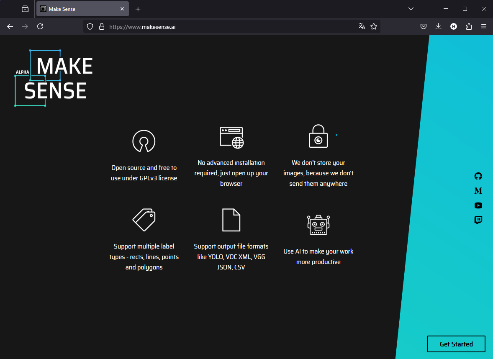
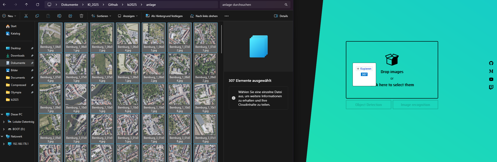
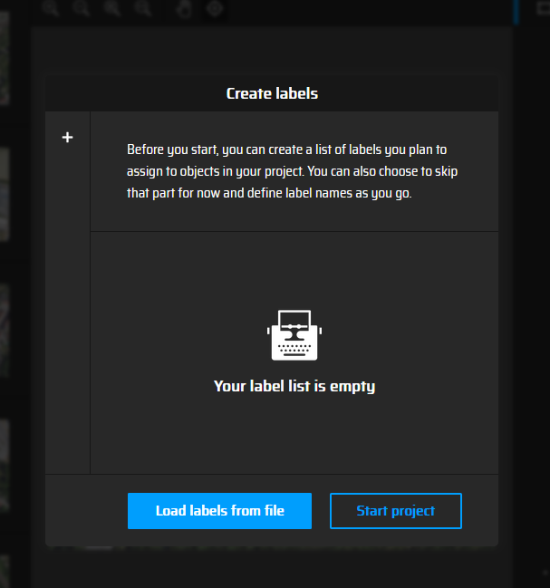
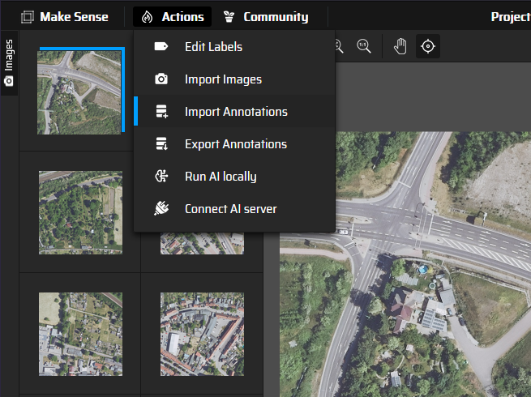
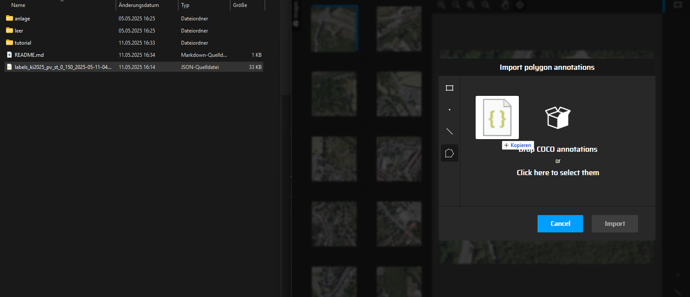

## 📷 Anleitung für Lucas

### 🟢 Was sollst du machen?
1. Folge der Anleitung ab "schritt 1 - Makesense.ai öffnen" bis "Schritt 5 - Labels einfügen III"
2. Prüfe die von mir annotieten Bilder 1 ~ 150.
3. Annotiere die Bilder 151 ~ 300 (bzw den Rest).
4. Exportiere die Annotationen über das Action Dropdown-Menü als Polygon -> "COCO JSON" Datei und lade sie im GitHub hoch.
5. Informiere mich.

### 🟢 Schritt 1 – Makesense.ai öffnen

📄 **Beschreibung:** Öffne die Website und klicke unten rechts auf "Get started".

---

### ⚙️ Schritt 2 – Bilder einfügen

📄 **Beschreibung:** Ziehe alle Bilder aus dem "anlage" Ordner in das Drop-Feld der Website und drücke auf den "Object Detection" Button.

---

### ✅ Schritt 3 – Labels einfügen I

📄 **Beschreibung:** Überspringe den "Labels erstellen"-Part, indem du auf "Start project" drückst.

---

### ✅ Schritt 4 – Labels einfügen II

📄 **Beschreibung:** Hover über "Actions" und wähle im Dropdown die Option "Import Annotations" aus.

---

### ✅ Schritt 5 – Labels einfügen III

📄 **Beschreibung:** Klicke auf die Option "Import Polygon annotations" und ziehe dort die Annotations Datei "labels_ki2025_pv_st_0_150_2025-xxx" hinein. Bestätige durch drücken auf "Import".

---

### ✅ Schritt 6 – Optional

📄 **Beschreibung:** Im Dropdown "Actions" kannst du die Labels editieren und deren Farbe anpassen, um sie besser zu unterscheiden. Die Farbe wird beim Export nicht übernommen.
